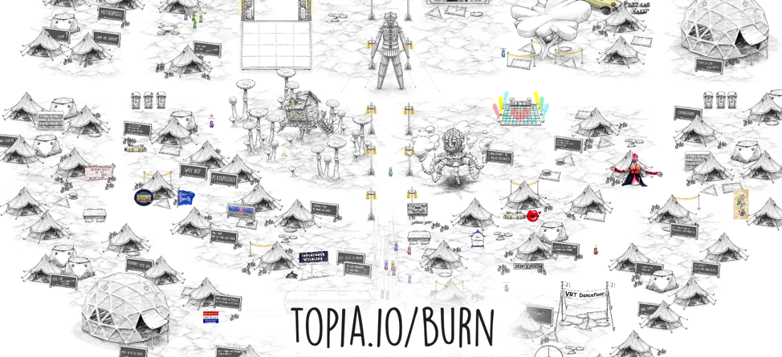
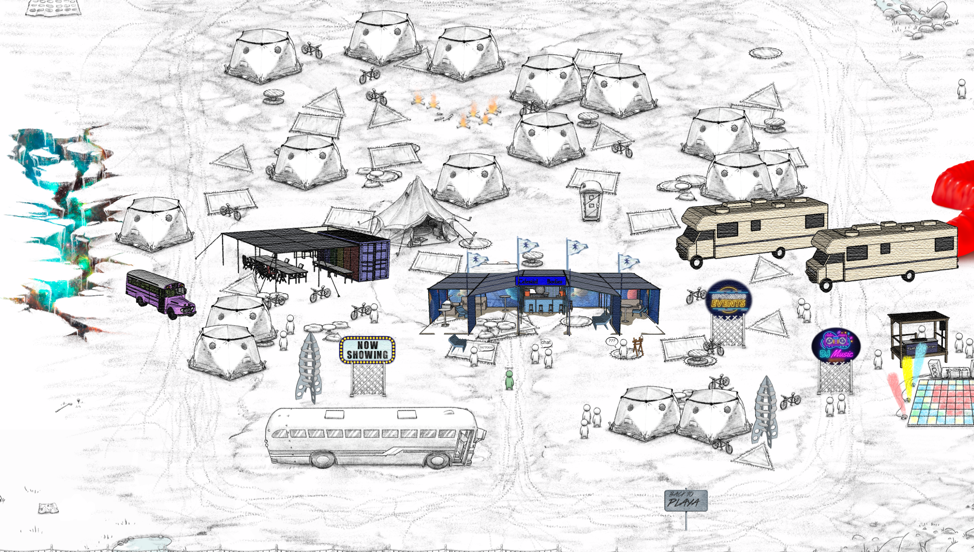
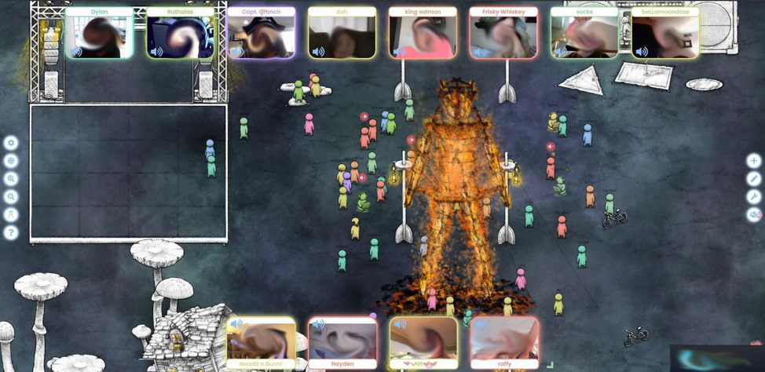
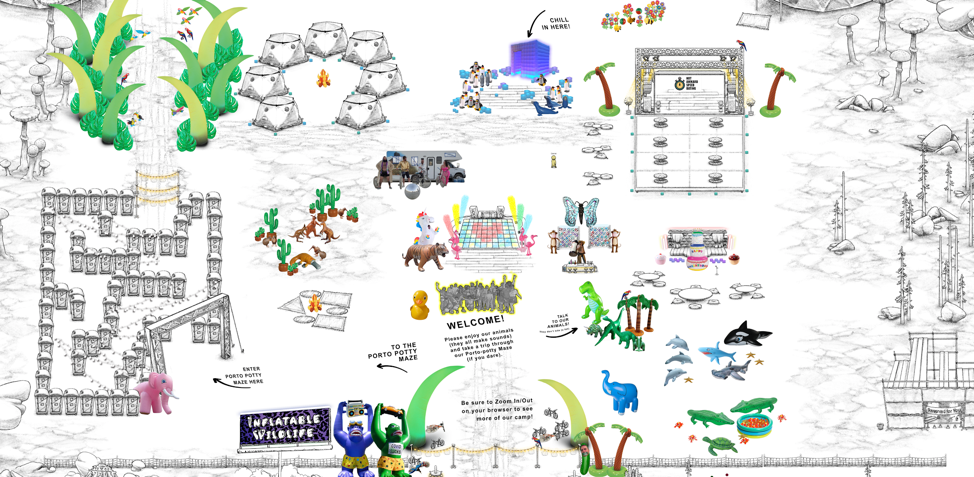

## Burning Man Cancelled
Back in April 2020, just as the global pandemic was ramping up and uncertainty overtook normal life, large events that bring people together started being cancelled.  Included in these events was the annual Burning Man pilgrimage, where ~80,000 people come together at the end of August to co-create a city in the middle of the desert and leave their normal life behind for a week of exploration and participation. We knew that the Burning Man organization was considering having an online event and we showed them a demo in June.  We were selected in July to be one of 8 recognized universes of the Burning Man Multiverse and called our burn experience Build-A-Burn.

## Burning Man and Build-A-Burn
The ramp up to Build-A-Burn was a frenzy of development.  We scrambled to pack in last-minute world building features, an event system, and improved UI, and onboarding.  At the same time, our Discord community was blowing up and builders were highly engaged and giving us feedback on how to improve the platform. Camp builders started trickling in and word of mouth quickly resulted in a torrent of camps being created and set up.  By the start of Burning Man, we had over 100 camps created and we had placed ~30 on the playa.  That’s when the real craziness started.

Once people started coming to Build-A-Burn, the response and feedback really blew us away.  People were shocked at how the experience so closely resembled that of being at Burning Man itself.  Our biggest surprise was the amount of effort camps spent building their worlds and by the middle of the week our number of unique and truly epic camps we placed on the playa doubled to 60+, all interconnected through our portal system.  Our numbers hockey-sticked and we wound up with 16k+ unique visitors over the week, thousands of conversations, an additional ~500 camps created, and tons of fun events hosted by camps including live DJ sets, comedians, singers, and even ‘non-awkward speed dating’.

These are a few examples of the many amazing camps created by the community for Build-A-Burn:

Celestial Bodies

The Burn

Teahouse

Inflatable Wildlife Inflataverse

On Saturday, as the playa became a nebula and a crowd gathered around the statue of the man, a particle fire erupted at its base and the crowd cheered.  The man burn lasted ~40 minutes and the emotions shared by the assembled group felt shockingly similar to how it felt to be at the burn.  Once the burn had finished, people scattered into groups going every which way.  There was a dance party in Ashram Galactica, a DJ at Art Island, groups of people wandering the playa and an ‘after-party’ at Sock Drawer (a hidden portal embedded in a sock deep-playa).

Build-A-Burn was the first burning man experience that was available to anyone, anywhere in the world.  We had participants from all over the globe - both veteran burners and people who had always wanted to go to Burning Man but found it inaccessible.  For many, this was the first time they experienced the ethos, serendipity, play, and human connection that is Burning Man.

## The Future
We're leaving [topia.io/burn](https://topia.io/burn) open as a burning man community space.  We highly recommend you come check it out with some friends and visit the different camps to see all the crazy stuff that got built.  There likely won't be 40+ person speed dating event going on, but you can explore the community built worlds and may run into fellow burners.  There are upcoming events being hosted by Build-A-Burn camps and, unlike the real-life city built in the desert, this online burn never needs to end.

Build-A-Burn validated for us that people are looking for authentic human connection and collaborative experiences during quarantine.  Curiosity brought people to Topia for the first time, but the ability to authentically connect with other humans kept them coming back over and over again.  They wandered around in small groups, explored camps together, made new friends and even went on dates.  It was pretty magical to see people's faces light up when they first realized what Topia was - a place where they could hang out with other burners and actually feel, even if just for a few hours, like they were at Burning Man. I hope the real burn happens next year so that I can meet some of my new friends in person.  In the meantime, we’ll have Topia.
